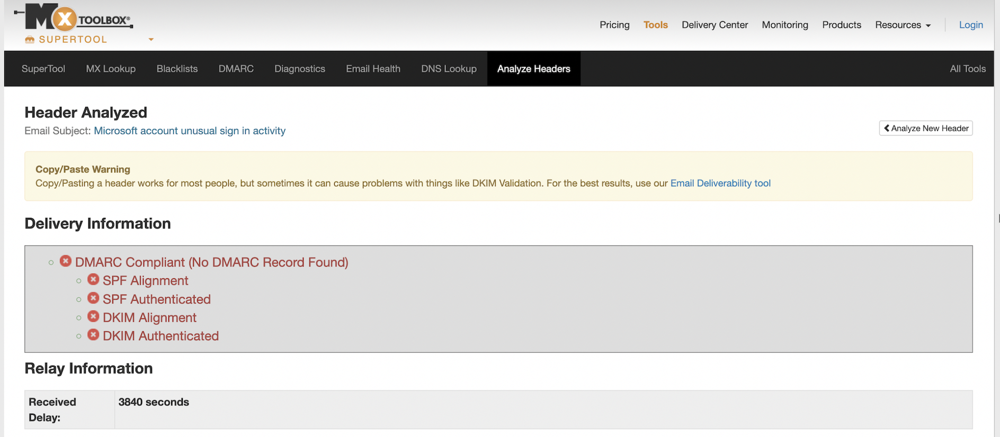
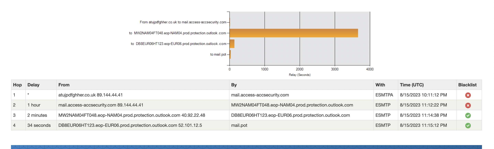

## Project Overview

This project documents an end-to-end investigation of a suspected phishing email from the perspective of a SOC Analyst.

The investigation begins with the initial analysis of the suspicious email and progresses through domain and infrastructure investigation, threat intelligence enrichment, identification of Indicators of Compromise (IOCs), and SIEM log analysis using Splunk.

The goal of the investigation was to determine whether the email was malicious, identify associated threats, investigate potential communication with suspicious infrastructure, and recommend appropriate incident response actions.

## Investigation Workflow

1. Initial phishing email analysis
2. Email header and sender investigation
3. Domain and mail infrastructure analysis using MXToolbox
4. URL, domain, IP, and file reputation analysis using VirusTotal
5. Identification of Indicators of Compromise (IOCs)
6. Threat intelligence analysis
7. Splunk log investigation
8. SPL query analysis
9. Investigation of suspicious outbound connections
10. Incident findings and assessment
11. Containment and remediation recommendations

## Tools Used

- Splunk
- SPL (Search Processing Language)
- VirusTotal
- MXToolbox
- Email header analysis
- Threat intelligence resources

## Skills Demonstrated

- Phishing Analysis
- Security Operations Center (SOC) Investigation
- Email Security Analysis
- Threat Intelligence
- IOC Identification
- SIEM Investigation
- Log Analysis
- SPL
- Incident Response
- Security Documentation

- 

---

# Investigation

## Phase 1: Initial Phishing Email Analysis

### Objective

The first stage of the investigation was to examine the suspicious email and identify characteristics commonly associated with phishing attacks.

Before investigating network or SIEM logs, I analyzed the email itself to understand the potential threat and identify Indicators of Compromise (IOCs) that could be used during later stages of the investigation.

### What I Examined

During the initial analysis, I reviewed:

- Sender information and email address
- Sender domain
- Email subject and message content
- Suspicious links or URLs
- Email header information
- Domain reputation
- Signs of spoofing or impersonation
- Urgency or social engineering techniques
- Potential Indicators of Compromise (IOCs)

### Investigation Approach

Rather than interacting directly with suspicious links, I extracted relevant indicators from the email for further analysis using external threat intelligence and email-security tools.

The identified indicators were then investigated using tools such as MXToolbox and VirusTotal to gather additional information about the sender infrastructure, domain reputation, and potential malicious activity.# Phishing Email Investigation & Threat Analysis

## Phase 2: Email Header Analysis with MXToolbox

### Objective

The next stage of the investigation was to analyze the email header to determine the true sending infrastructure and evaluate whether the message passed standard email authentication checks.

I used MXToolbox to analyze the email header and review SPF, DKIM, DMARC, routing information, and other header fields for signs of spoofing or impersonation.

### Email Authentication Analysis

The MXToolbox analysis identified several authentication and identity anomalies:

- **DMARC:** No discoverable DMARC record was found for the sender domain.
- **SPF Alignment:** Failed, indicating that the sending domain did not align with the domain presented in the visible From address.
- **SPF Authentication:** Failed for the originating sender IP.
- **DKIM Alignment:** Failed because no valid DKIM signing domain aligned with the visible From domain.
- **DKIM Authentication:** Failed because a valid DKIM signature could not be verified.
- **Brand/Domain Mismatch:** The email presented itself as a Microsoft account-security message, but the visible sender domain was `access-accsecurity.com`.
- **Reply-To Mismatch:** Replies were directed to an unrelated Gmail address rather than Microsoft or the visible sender domain.

These findings did not rely on a single indicator. The combination of failed email-authentication checks, identity inconsistencies, and sender/Reply-To mismatches increased the suspicion that the message was a phishing attempt.

### Email Routing and Originating IP Analysis

The email header routing information was reviewed to trace the path the message followed through the mail infrastructure.

The analysis identified `89.144.44.41` in the early email-routing hops. This IP address was extracted as an Indicator of Compromise (IOC) for further investigation.

The message subsequently passed through Microsoft/Outlook mail infrastructure. The presence of legitimate mail servers later in the routing path does not by itself establish that the original sender was legitimate.

### IOC Identified

- **Originating/Sender IP:** `89.144.44.41`
